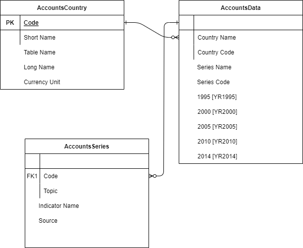
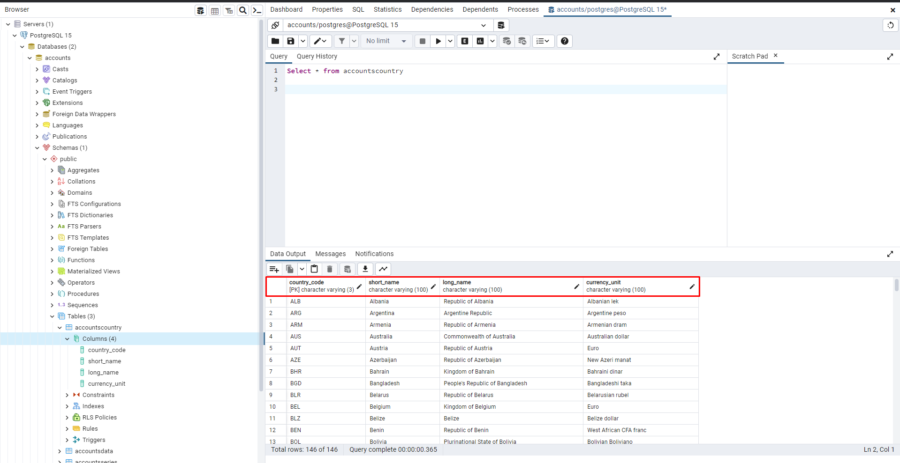

# Python_DataBases
Criando Banco de Dados com Python! 

# Overview do projeto
Projeto simples e objetivo de Engenharia de dados. O mesmo consite em criar um banco de dados apartir das informaçoes de arquivos CSV. 

# modelagem 
Foi feita uma modelagem de um banco de dados, para entender os campos e como funcionaria o relacionamento entre as tabelas.

# Resultado 
Apos fazer toda manipulação dos dados usando o Pandas, os Dados foi inseridos no Banco de dados. 

## Libs usadas! 
- Python
1. pandas
2. psycopg2

